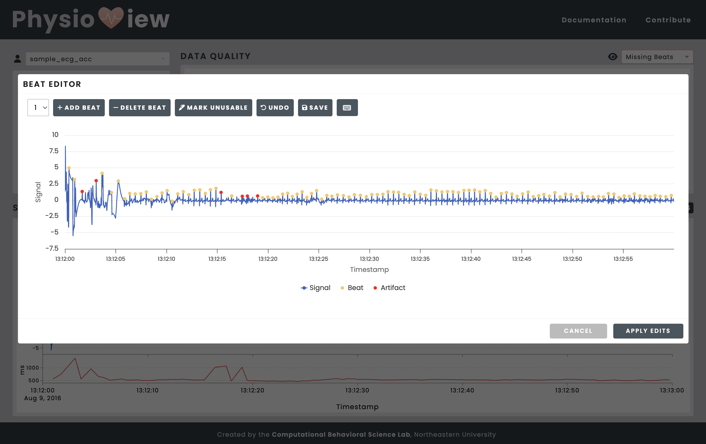

.. raw:: html

    

.. role:: bolditalic
   :class: bolditalic

===============
Getting Started
===============

Overview
========
The PhysioView Beat Editor is a web application providing out-of-the-box
functionality for visualizing and editing electrocardiograph and
photoplethysmograph data.

Installation
============
The Beat Editor requires Node. Please refer to the installation instructions
on their `website <https://nodejs.org/en/download/>`_. Once Node is
installed, you can check if the installation was successful by running:

.. code-block:: bash

    $ node --version
    $ npm --version

If the command returns a version number, Node is installed correctly. (Please
refer to the `Node.js documentation <https://nodejs.org/docs/latest/api/>`_
for additional troubleshooting.)

From the main ``physioview`` root directory, navigate to the
``beat-editor/frontend`` subdirectory and run the following command to
install all required modules for the Beat Editor:

.. code-block:: bash

    $ cd beat-editor/frontend
    $ npm install

Next, we need to install the backend server dependencies.
Navigate to ``beat-editor/backend`` and run the following command to install
all required modules:

.. code-block:: bash

    $ cd ../backend
    $ npm install

Launching the Beat Editor
=========================
To launch the Beat Editor, we have to boot up the back-end server first:

1. Navigate to the ``beat-editor/backend`` subdirectory.

.. code-block:: bash

    $ cd beat-editor/backend

2. Start the back-end server by running:

.. code-block:: bash
    
    $ npm start

If the Terminal displays this message, then the server is running successfully:

.. code-block:: bash
  
    >server@1.0.0 start
    >node app.js

    Server is running on port 3001

3. Open a new Terminal tab or window and navigate to the main
``beat-editor/frontend`` subdirectory.

.. code-block:: bash

    $ cd ../frontend

4. Start the front end by running:

.. code-block:: bash
    
    $ npm run dev

If the Terminal displays this message, then the front end is running successfully:

.. code-block:: bash

      VITE v7.1.1  ready in 254 ms

      ➜  Local:   http://localhost:3000/
      ➜  Network: http://10.0.0.81:3000/
      ➜  press h + enter to show help

If the terminal displays an error or warning, please kill the process by
pressing ``CTRL`` + ``C`` and try running the command to start the front end
again.

Accessing the Beat Editor
=========================
The Beat Editor can be accessed as a standalone web application at
http://localhost:3000. However, for the best experience, we recommend
launching it with the "Beat Editor" button from within the PhysioView
Dashboard, where it is fully integrated with the rest of the application.

| **Note:** The Beat Editor application :bolditalic:`must be running (both
  the back end and front end)` in order for it to be accessed through the
  PhysioView Dashboard.

Terminating the Beat Editor
===========================
1. In the terminal where the backend server is running, press ``CTRL`` + ``C`` to stop the server.
2. In the terminal where the front end is running, press ``CTRL`` + ``C`` to stop the front end.