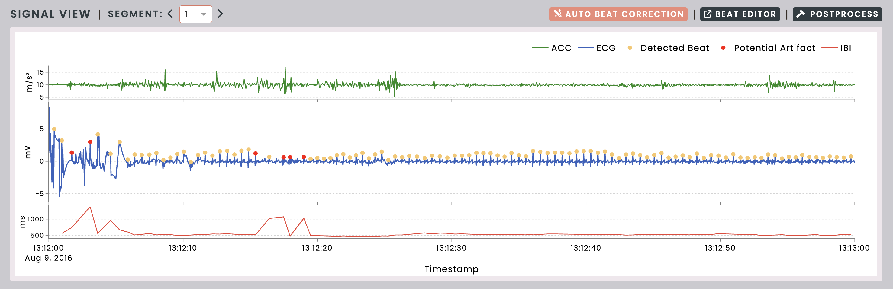
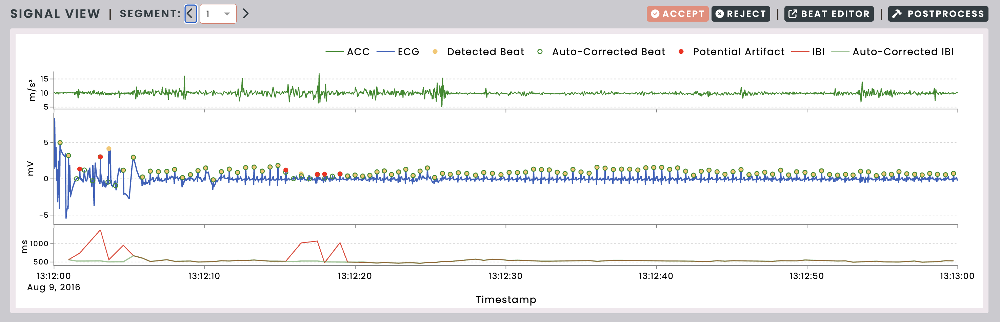

.. raw:: html

    

.. role:: bolditalic
   :class: bolditalic

.. |br| raw:: html

   

=========================
Automated Beat Correction
=========================

For cardiac signals, PhysioView includes an automated beat correction tool
that suggests potential beat locations using a time-domain approach [1_]. To
use it, click the "Auto Beat Correction" button.

.. _1: https://doi.org/10.3758/s13428-017-0950-2

|br|

The suggested beats will then appear in the signal plot. After reviewing the
suggestions, click "Accept" to apply them or "Reject" to discard them.

