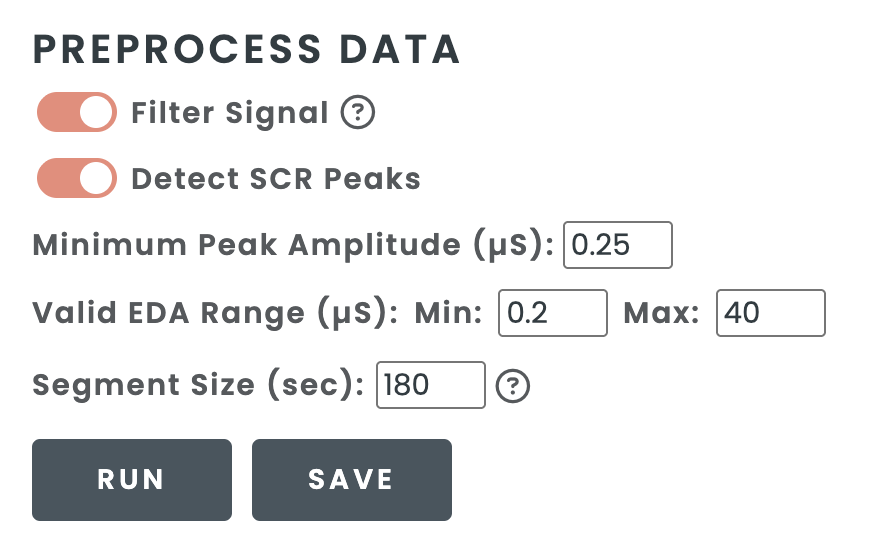

.. raw:: html

    

.. role:: bolditalic
   :class: bolditalic

.. |br| raw:: html

   

=======================
Data Quality Assessment
=======================

Uploading Data
==============

Once the dashboard application has been launched in your web browser, select
your data file. PhysioView will accept raw European Data Formatted (.edf) files
outputted by the Actiwave Cardio, archive (.zip) files outputted by the
Empatica E4 or created for a batch of files, and comma-separated values (.csv)
files outputted by other devices.

|br|

Single-File Uploads
-------------------

In this example, a single CSV file containing raw ECG and accelerometer
data for one subject is uploaded to the dashboard.

|br|

| Specify the data type and sampling rate, and map the CSV headers to the
  corresponding sample/timestamp and signal variables.

|br|

Batch Uploads
-------------

PhysioView can also process multiple CSV files packaged in a ZIP archive for
visualization and quality assessment on the dashboard. All CSV files in the
ZIP archive must have **identical headers**.

Setting Data Parameters
=======================

In both the cardiac and EDA processing pipelines, filtering can be enabled
and the segment size defined for quality assessment.

|br|

ECG/PPG Data
------------

Select whether to filter your cardiac data and choose an artifact
identification method and tolerance value (any floating-point value between
0 and 2) and beat detection algorithm. By default, beats in ECG signals are
detected with a Shannon energy envelope approach [1_] and beats in PPG
signals are detected with an adaptive thresholding algorithm [2_]. Artifacts
are identified using the criterion beat difference test [3_].

.. _1: https://doi.org/10.1016/j.bspc.2011.03.004
.. _2: https://doi.org/10.1016/j.trf.2019.09.015
.. _3: https://doi.org/10.1111/j.1469-8986.1990.tb01982.x

|br|

EDA Data
--------

Specify the sampling rate for the EDA data and map the CSV headers to the
corresponding timestamp and signal variables. Optionally, either load a
separate CSV file containing a single temperature column (with at most one
header row) or map a temperature variable directly from the primary CSV file.

.. image:: _static/dashboard-eda-setup.png
    :width: 700
    :align: center

|br|

| Select whether to filter the EDA data and detect skin conductance response
  (SCR) peaks [4_], specifying the minimum peak amplitude and the valid EDA
  value range.

.. _4: https://doi.org/10.1109/JTEHM.2018.2878000

Viewing Signal Quality Metrics
==============================

PhysioView's main dashboard shows three panels.

| :bolditalic:`Data Summary` displays information about the loaded data file
  and signal quality metrics.

| :bolditalic:`Data Quality` shows interactive bar charts of quality
  metrics, such as numbers of missing and artifactual beats per segment in
  cardiac signals and proportions of invalid data points or values that are
  out of range or contain excessive slopes in EDA signals.

| :bolditalic:`Signal View` shows the primary signal (ECG/PPG/EDA), its
  associated signals (interbeat intervals or temperature), and, if given,
  the acceleration signal preprocessed from the uploaded data.

Exporting the Data Summary
==========================

The **Export Summary** button in the :bolditalic:`Data Summary` panel allows you
to download the data quality assessment summary for either a single file or a
batch of files as a ZIP archive file or an Excel workbook. For batch
exports in Excel mode, a separate workbook is created for each subject and
all workbooks are packaged together in a ZIP archive.

| Download an example Excel workbook with the SQA summary `here <../../../examples/sample_ecg_acc_sqa_summary.xlsx>`_.